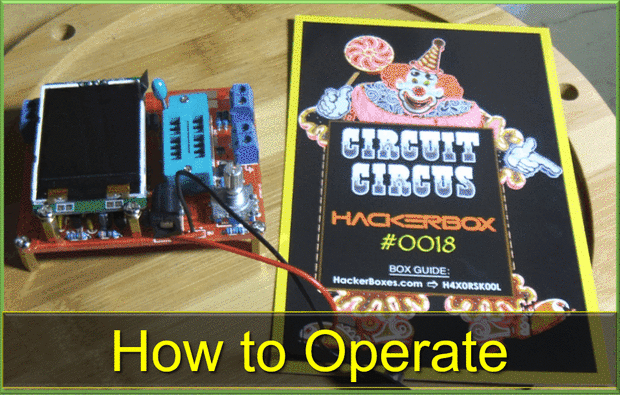
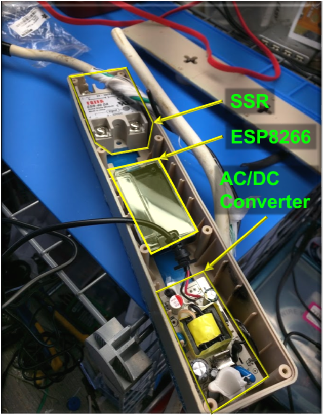
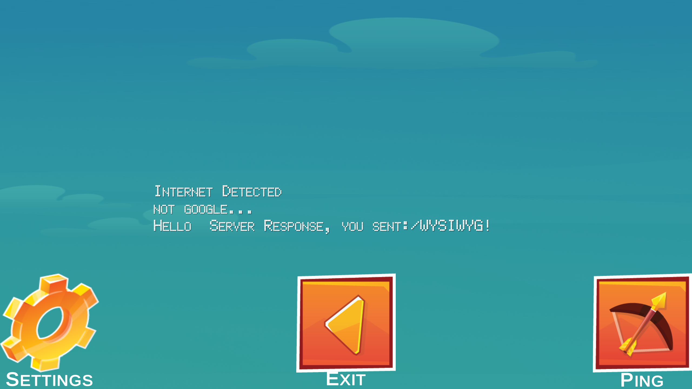

Welcome. Here I'll include general introductions to various projects and endeavors, and a link for looking into the details.

tl;dr header menu: 
* [Hacker Tracker Instructable](#hacker-tracker)
* [Circuit Tester Instructables](#circuit-circus)
* [SMD Soldering Instructable](#a-technique-for-soldering-smd-components)
* [Tip Tinning Techniques Instructable](#tinning-tips)
* [Sewage Pump Situation](#sewagea-no-fail-situation) - Monitoring, controlling, bypassing main switch, etc.
  * [The Piggyback Plug Piggyback hardware](#piggyback-plug)
  * [The eTape solid state pressure sensor](#etape-sensor)
  * [Using Blynk](#blynk-stuff)
* [who is hacking me? Project (honey pot thing)](#who-is-hacking-me)
* Untraceable Device that Proxy through i2p (older project not on github yet)
* TBD as I go back and forth in time

## HackerBoxes and Instructables
I really enjoyed getting into the [hackerboxes](https://hackerboxes.com/) when I get time, and I found that I also really enjoyed making simple how-to tutorials to help myself and anyone else who is interested. I've been publishing them on [Instructables](https://www.instructables.com/member/jumson/) and here are some individual links.

### Hacker Tracker
[The HackerTracker](http://www.instructables.com/id/Hacker-Tracker-in-Depth/) is a device that melds together a GPS module, SD Card Module, an Arduino Nano and a 3-Axis Compass. 


### Circuit Circus
[Assembling](https://www.instructables.com/id/Circuit-Circus-in-Depth-Tech/) and [Operating](https://www.instructables.com/id/How-to-Operate-the-Transistor-Tester-With-AVR-Micr/) the "Circuit Circus" Circuit and Component Tester. 

<table>
    <tr>
      <td>
        
      </td>
      <td>
        
      </td>
    </tr>
 </table>


### A Technique for Soldering SMD components
As I was experimenting with small electronics, I realized I do not really have all the tools I need. I developed this little technique and some people seemed to appreciate it. 

[How to Solder SMD / SMT Components With a Soldering Iron](http://www.instructables.com/id/How-to-Solder-SMD-SMT-Components-With-a-Soldering-/)


### Tinning Tips
I made this small tutorial to show a way I was using to tin tips of little twisted wires to help with future soldering. I used a different camera this tmie and the image quality was not as good.

[Easy Tip Tinning Technique](http://www.instructables.com/id/Easy-Tip-Tinning-Technique/)


* * *
## Problem Solving....Projects


### Sewage...a "no fail" situation
So my sewage goes into a little basin at the lowest point in the house, which is below the sewage line at the street. Then it gets pumped up to the sewage line when it reaches a certain level. The pump is controlled by a mechanical float switch that rises and falls with the sewage level. Sometiems it does not work....and there is no way to know until it comes out and ruins things. Like, weekends. And floores. And my wife's sense of security.

So I had to fix it. Traditionally, when I get down stairs and find the "situation" I unplug the pump from the "piggyback" switch/plug, and plug it directly into the socket, which turns on the pump. Then sometimes the swtch works just fine. Sometiems I open it up and peer inside and do not see anything wrong with it, and it works just fine. 

Being as how I have 100% complete situational awareness, I came to the conclusion that this was a supernatural event, and that I can fix it with technology. I learned this from Ghostbusters as a child.

My idea was to make another piggyback plug/switch that could have an alternative sensor to detect when the first switch did not trigger on, and "bypass" it by switching on power directly to the pump until the level goes down.

So I made the thing, that turned into a much bigger thing than I thought it would. The various components are described below, with links to parts of the repository.
<h5 id="piggyback-plug"></h5>

<table style="border: 1px solid black; width=100%;">
    <col style="width:60%;">
    <col style="width:40%;">
    <tr>
      <th style="text-align: center;">Project Part</th>
      <th style="text-align: center;">Picture</th>
    </tr>
    <tr style="vertical-align: top;">
      <td style="text-align: left; vertical-align: top;">
        There is the old surge protector that did not work anymore, I converted it into the power switching / logic box. This part controls the power and holds the little ESP8266, reading the other sensor, ad which decides when to close the Solid State Relay. It will also/eventually detect when current is flowing through the main switch for later analysis/learning. I’ll need to get some pictures on here. <a href="https://github.com/jumson/pumpWatcher/tree/master/ESP8266_Code">The code programmed into the ESP8266 is found here</a>
      </td>
      <td style="text-align: center">
        
      </td>
    </tr>
    <tr>
      <td style="text-align: left">
      <meta id="etape-sensor">Then there is the <a href="https://milonetech.com/">eTape sensor from Milone Technologies</a>. This is a solid state pressure sensor designed to be used in “chemical” environments.</td>
      <td style="text-align: center"><em>picture goes here</em></td>
    </tr>
    <tr>
      <td style="text-align: left">
      <meta id="blynk-stuff">I was originally using <a href="http://www.blynk.cc/">Blynk</a> to get the raw data, do some calculation and convert it to inches, and track the water levels with graphs. I made my own server so that i could try out all the bells and whistles without paying anything.</td>
      <td style="text-align: center"><em>picture goes here</em></td>
    </tr>
    <tr>
      <td style="text-align: left">To test it out as a proof of concept, I got a small little pond pump, and with the help of the <a href="http://www.npsfoundation.org/makers-club">NPS Makers Club</a> and the <a href="https://my.nps.edu/web/robodojo">NPS RoboDojo’s</a> Laser Cutter, I made a contraption to perpetually pump / refill so I could fine tune and look for points of failure. (pictures….sometime. And video)</td>
      <td style="text-align: center"><em>picture here</em></td>
    </tr>
    <tr>
      <td style="text-align: left">Then I thought, why can’t I just make my own server and let the device (now dubbed, the PumpWatcher(c)) send GET requests with encoded/formatted information, where I could make logs? <a href="https://github.com/jumson/pumpWatcher/tree/master/Server_Code">So I did that</a>, making a server that recieves that data, saves the data into a CSV file, and converts/streams it to an HTML table and sending it as a webpage for me to look at.</td>
      <td style="text-align: center"><em>probably no picture for this….</em></td>
    </tr>
    <tr>
      <td style="text-align: left">NOW, I’m working on bypassing BLYNK altogether, mainly because I think I can. I’m using Unity to create an app that interfaces with my pumpWatcher device just the way I want. The current prototype is able to send and recieve HTML to / from my server. Next, I’ll find a way to “authenticate” and then control the pump (turning it on / off / setting the pump on/off trigger s, displaying the data)</td>
      <td style="text-align: center"><br /> </td>
    </tr>
</table>


* * *
### [](#whoIsHacking)Who is Hacking me?
Sometime over the Christmas break, I was looking through my logs on a public facing server, where I usually interact through SSH on port 22 (note to self, use a different port (note to self, already changed it)).

*   This is what I found -- tons of it, sometimes hundreds of attempts in an hour!
```
Dec 24 06:53:39 i2p sshd[30040]: pam_unix(sshd:auth): authentication failure; logname= uid=0 euid=0 tty=ssh ruser
Dec 24 06:53:41 i2p sshd[30040]: Failed password for root from 92.252.229.23 port 36945 ssh2
Dec 24 06:53:44 i2p sshd[30040]: Failed password for root from 92.252.229.23 port 36945 ssh2
Dec 24 06:53:46 i2p sshd[30040]: Failed password for root from 92.252.229.23 port 36945 ssh2
Dec 24 06:53:49 i2p sshd[30040]: Failed password for root from 92.252.229.23 port 36945 ssh2
Dec 24 06:53:52 i2p sshd[30040]: Failed password for root from 92.252.229.23 port 36945 ssh2
Dec 24 06:53:55 i2p sshd[30040]: Failed password for root from 92.252.229.23 port 36945 ssh2
Dec 24 06:53:55 i2p sshd[30040]: Disconnecting: Too many authentication failures for root from 92.252.229.23 port
Dec 24 06:53:55 i2p sshd[30040]: PAM 5 more authentication failures; logname= uid=0 euid=0 tty=ssh ruser= rhost=5
Dec 24 06:53:55 i2p sshd[30040]: PAM service(sshd) ignoring max retries; 6 > 3
Dec 24 06:55:01 i2p CRON[30042]: pam_unix(cron:session): session opened for user root by (uid=0)
Dec 24 06:55:01 i2p CRON[30042]: pam_unix(cron:session): session closed for user root
Dec 24 06:55:03 i2p sshd[30045]: Connection closed by 51.254.204.239 [preauth]
Dec 24 06:57:50 i2p sshd[30048]: fatal: no matching cipher found: client aes128-cbc,blowfish-cbc,3des-cbc server
Dec 24 06:58:00 i2p sshd[30050]: Did not receive identification string from 195.154.49.127
Dec 24 06:59:03 i2p sshd[30051]: Invalid user admin from 58.227.194.254
Dec 24 06:59:03 i2p sshd[30051]: input_userauth_request: invalid user admin [preauth]
Dec 24 06:59:03 i2p sshd[30051]: pam_unix(sshd:auth): check pass; user unknown
Dec 24 06:59:03 i2p sshd[30051]: pam_unix(sshd:auth): authentication failure; logname= uid=0 euid=0 tty=ssh ruser
Dec 24 06:59:06 i2p sshd[30051]: Failed password for invalid user admin from 58.227.194.254 port 37905 ssh2
Dec 24 06:59:06 i2p sshd[30051]: pam_unix(sshd:auth): check pass; user unknown
Dec 24 06:59:08 i2p sshd[30051]: Failed password for invalid user admin from 58.227.194.254 port 37905 ssh2
Dec 24 06:59:08 i2p sshd[30051]: pam_unix(sshd:auth): check pass; user unknown
Dec 24 06:59:10 i2p sshd[30051]: Failed password for invalid user admin from 58.227.194.254 port 37905 ssh2
Dec 24 06:59:10 i2p sshd[30051]: pam_unix(sshd:auth): check pass; user unknown
Dec 24 06:59:12 i2p sshd[30051]: Failed password for invalid user admin from 58.227.194.254 port 37905 ssh2
Dec 24 06:59:12 i2p sshd[30051]: pam_unix(sshd:auth): check pass; user unknown
Dec 24 06:59:15 i2p sshd[30051]: Failed password for invalid user admin from 58.227.194.254 port 37905 ssh2
Dec 24 06:59:15 i2p sshd[30051]: pam_unix(sshd:auth): check pass; user unknown
Dec 24 06:59:17 i2p sshd[30051]: Failed password for invalid user admin from 58.227.194.254 port 37905 ssh2
Dec 24 06:59:17 i2p sshd[30051]: Disconnecting: Too many authentication failures for invalid user admin from 58.2
Dec 24 06:59:17 i2p sshd[30051]: PAM 5 more authentication failures; logname= uid=0 euid=0 tty=ssh ruser= rhost=5
Dec 24 06:59:17 i2p sshd[30051]: PAM service(sshd) ignoring max retries; 6 > 3
Dec 24 06:59:43 i2p sshd[30053]: Connection closed by 51.254.204.239 [preauth]
Dec 24 07:04:23 i2p sshd[30057]: Connection closed by 51.254.204.239 [preauth]
Dec 24 07:05:01 i2p CRON[30059]: pam_unix(cron:session): session opened for user root by (uid=0)
Dec 24 07:05:01 i2p CRON[30059]: pam_unix(cron:session): session closed for user root
Dec 24 07:09:03 i2p sshd[30063]: Connection closed by 51.254.204.239 [preauth]
Dec 24 07:13:44 i2p sshd[30066]: Connection closed by 51.254.204.239 [preauth]
Dec 24 07:15:01 i2p CRON[30068]: pam_unix(cron:session): session opened for user root by (uid=0)
Dec 24 07:15:01 i2p CRON[30068]: pam_unix(cron:session): session closed for user root
Dec 24 07:15:57 i2p sshd[30071]: Connection closed by 95.110.245.209 [preauth]
Dec 24 07:17:01 i2p CRON[30073]: pam_unix(cron:session): session opened for user root by (uid=0)
Dec 24 07:17:01 i2p CRON[30073]: pam_unix(cron:session): session closed for user root
Dec 24 07:18:23 i2p sshd[30078]: Connection closed by 51.254.204.239 [preauth]
```

*   SO I wondered who in the world (what in the world) were they trying to do? What passwords did they think were going to work? What would they do once they got in?
*   I moved my port and replaced it with another server I wrote in NodeJS. It would accept the connection, pretend to authenticate (after logging the pertinent data like IP address, username/password, etc) and then log anything else the connecting device attempted to do. So that is a neat ongoing project, [the code is here](https://github.com/jumson/sshMON/tree/master/fakeServer). I also logged everythign in CSV and made sure I could check on it by simply sending a GET request with the right URL and It would spit ou a formatted HTML table with the data for me to peruse, or let me download the CSV to filter it in EXCEL.
*   Future objectives with this include using an API to query if the IPs are already registered offenders, and then report them if not, or gather more info for my own analysis. I was planning to go through these folks: [https://www.abuseipdb.com/](https://www.abuseipdb.com/).


